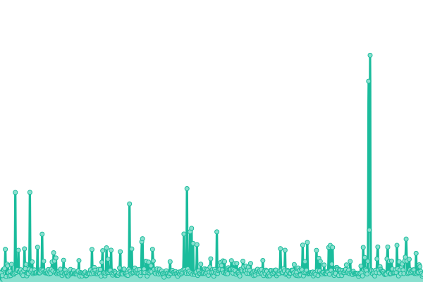
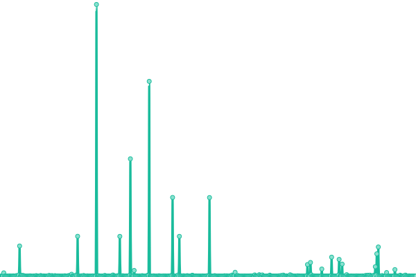
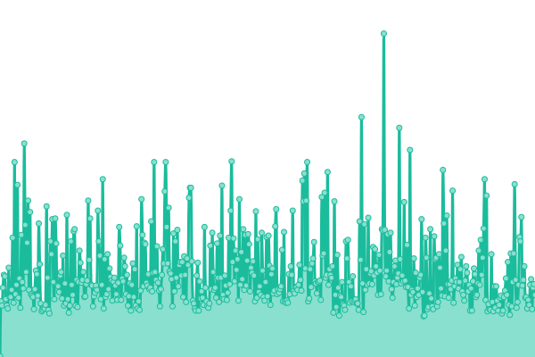

# [📈 Live Status](https://loyds44.github.io/uptime): <!--live status--> **🟧 Partial outage**

This repository contains the open-source uptime monitor and status page for [loyds44](https://loyds44.github.io/uptime), powered by [Upptime](https://github.com/upptime/upptime).

With [Upptime](https://upptime.js.org), you can get your own unlimited and free uptime monitor and status page, powered entirely by a GitHub repository. We use [Issues](https://github.com/loyds44/uptime/issues) as incident reports, [Actions](https://github.com/loyds44/uptime/actions) as uptime monitors, and [Pages](https://loyds44.github.io/uptime) for the status page.

<!--start: status pages-->
<!-- This summary is generated by Upptime (https://github.com/upptime/upptime) -->
<!-- Do not edit this manually, your changes will be overwritten -->
<!-- prettier-ignore -->
| URL | Status | History | Response Time | Uptime |
| --- | ------ | ------- | ------------- | ------ |
|  [Linksta](https://linksta.cc/@loyds44) | 🟩 Up | [linksta.yml](https://github.com/loyds44/uptime/commits/HEAD/history/linksta.yml) | 

 952ms
     
 | 

<a href="https://loyds44.github.io/uptime/history/linksta">100.00%</a>
    

|  [Google](https://www.google.com/) | 🟩 Up | [google.yml](https://github.com/loyds44/uptime/commits/HEAD/history/google.yml) | 

 90ms
     
 | 

<a href="https://loyds44.github.io/uptime/history/google">100.00%</a>
    

|  [Discord](https://discord.com/) | 🟩 Up | [discord.yml](https://github.com/loyds44/uptime/commits/HEAD/history/discord.yml) | 

 107ms
     
 | 

<a href="https://loyds44.github.io/uptime/history/discord">100.00%</a>
    

|  [Fake Site](https://cesitenexistepasfake.ko.co) | 🟥 Down | [fake-site.yml](https://github.com/loyds44/uptime/commits/HEAD/history/fake-site.yml) | 

 0ms
     
 | 

<a href="https://loyds44.github.io/uptime/history/fake-site">0.10%</a>
    

<!--end: status pages-->

[**Visit our status website →**](https://loyds44.github.io/uptime)

## 📄 License

- Powered by: [Upptime](https://github.com/upptime/upptime)
- Code: [MIT](./LICENSE) © [Anand Chowdhary](https://anandchowdhary.com), supported by [Pabio](https://pabio.com)
- Data in the `./history` directory: [Open Database License](https://opendatacommons.org/licenses/odbl/1-0/)
